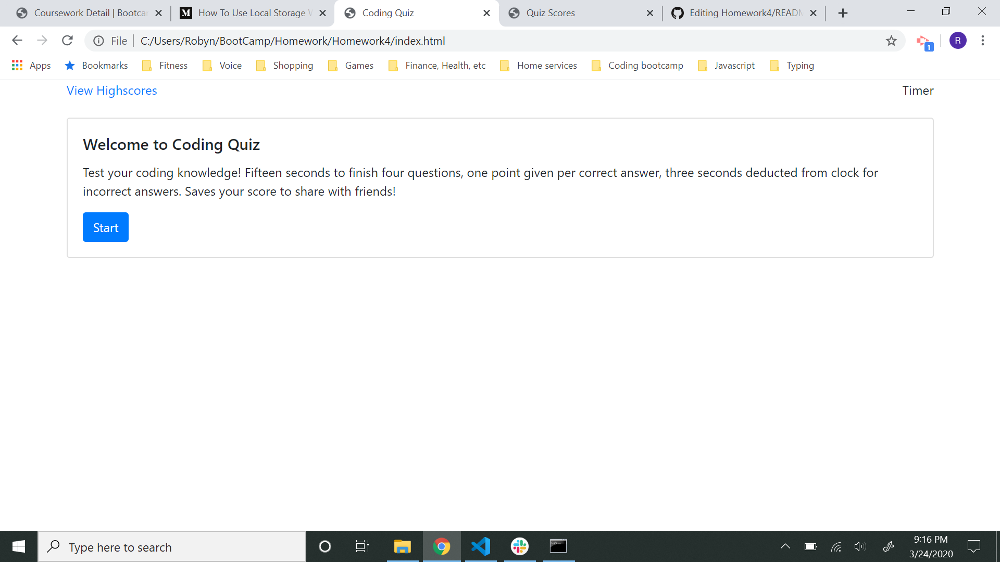
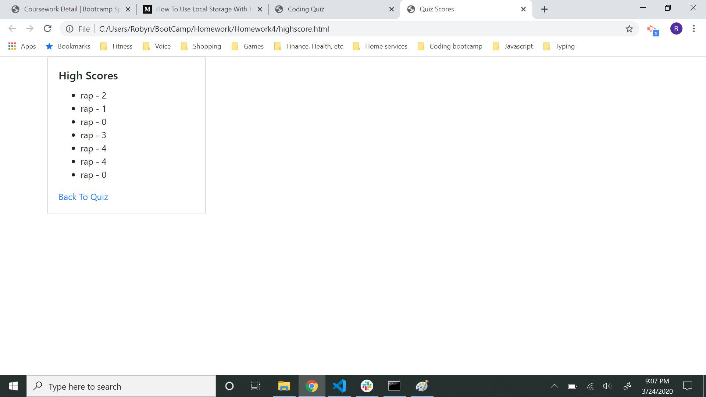

# Homework4
# 04 Web APIs: Code Quiz

## User Story

```
AS A coding bootcamp student
I WANT to take a timed quiz on JavaScript fundamentals that stores high scores
SO THAT I can gauge my progress compared to my peers
```
## Description

This application is a timed coding quiz.  When the start button is pushed, the user has fifteen second to answer four questions about coding. One point is given for each correct answer.  If a question is answered incorrectly, three seconds are deducted from the remaining time.  When either the questions are finished or the time passes zero, the quiz stops and the final score is given.  The scores with user initials can then be stored on the high scores page.

## Completed

```
* A start page presents instructions, timer, a link to high scores page, and start button
* The start button presents questions card with answer buttons.  
* Button click triggers next question.
* Correct answers add points to score, incorrect ones deduct time from timer.
* Game end conditions are either questions finished or time passes zero.
* Option given to save score with initials. 
* Scores can be viewed on separate page with link to return to quiz.


## URL of Deployed Application

[Coding Quiz](https://robynp108.github.io/Homework4/)

## Screenshots of Start Page and High Score Page




```

